<h1 align="center">Web Programming</h1>

- [1. chapter 1:](#1-chapter-1)
  - [1.1. TCP, IP, Protocols (How it works):](#11-tcp-ip-protocols-how-it-works)
    - [1.1.1. What is a Protocol:](#111-what-is-a-protocol)
    - [1.1.2. TCP/IP (Transmission Control Protocol / Internet Protocol):](#112-tcpip-transmission-control-protocol--internet-protocol)
      - [1.1.2.1. TCP (Transmission Control Protocol):](#1121-tcp-transmission-control-protocol)
      - [1.1.2.2. IP (Internet Protocol):](#1122-ip-internet-protocol)
    - [1.1.3. How TCP and IP Work Together:](#113-how-tcp-and-ip-work-together)
  - [1.2. DNS Process:](#12-dns-process)
    - [1.2.1. What is DNS:](#121-what-is-dns)
    - [1.2.2. How DNS Works:](#122-how-dns-works)
  - [1.3. Web Accessibility:](#13-web-accessibility)
    - [1.3.1. What is Web Accessibility:](#131-what-is-web-accessibility)
    - [1.3.2. Why is Web Accessibility Important:](#132-why-is-web-accessibility-important)
    - [1.3.3. Common Accessibility Features:](#133-common-accessibility-features)
  - [1.4. Web Clients and Web Servers:](#14-web-clients-and-web-servers)
    - [1.4.1. What is a Web Client:](#141-what-is-a-web-client)
    - [1.4.2. What is a Web Server:](#142-what-is-a-web-server)
    - [1.4.3. How They Work Together:](#143-how-they-work-together)
- [2. Chapter 2:](#2-chapter-2)
  - [2.1. Table, Form, Hyperlink, Images, Lists (How Those Tags Work):](#21-table-form-hyperlink-images-lists-how-those-tags-work)
    - [2.1.1. Table:](#211-table)
    - [2.1.2. Form:](#212-form)
    - [2.1.3. Hyperlink:](#213-hyperlink)
    - [2.1.4. Images:](#214-images)
    - [2.1.5. Lists:](#215-lists)
  - [2.2. Difference Between Block and Inline Elements:](#22-difference-between-block-and-inline-elements)
    - [2.2.1. Block Elements:](#221-block-elements)
    - [2.2.2. Inline Elements:](#222-inline-elements)
    - [2.2.3. Block and Inline example:](#223-block-and-inline-example)
  - [2.3. HTML Semantic Elements:](#23-html-semantic-elements)
- [3. Chapter 3:](#3-chapter-3)
  - [3.1. CSS Selectors (Element, Class, and ID):](#31-css-selectors-element-class-and-id)
    - [3.1.1. Element Selector:](#311-element-selector)
    - [3.1.2. Class Selector:](#312-class-selector)
    - [3.1.3. ID Selector:](#313-id-selector)
  - [3.2. CSS Display Property:](#32-css-display-property)
    - [3.2.1. display: block:](#321-display-block)
    - [3.2.2. display: inline:](#322-display-inline)
    - [3.2.3. display: inline-block:](#323-display-inline-block)
    - [3.2.4. display: none:](#324-display-none)
    - [3.2.5. Summary:](#325-summary)
  - [3.3. CSS Position Property:](#33-css-position-property)
    - [3.3.1. position: static:](#331-position-static)
    - [3.3.2. position: relative:](#332-position-relative)
    - [3.3.3. position: absolute:](#333-position-absolute)
    - [3.3.4. position: sticky:](#334-position-sticky)
    - [3.3.5. position: fixed:](#335-position-fixed)
    - [3.3.6. CSS Grid:](#336-css-grid)
      - [3.3.6.1. Simple Example:](#3361-simple-example)
    - [3.3.7. CSS Media Queries:](#337-css-media-queries)
  - [3.4. CSS Viewport:](#34-css-viewport)
    - [3.4.1. Viewport Units:](#341-viewport-units)
    - [3.4.2. Examples:](#342-examples)
  - [3.5. How to add CSS:](#35-how-to-add-css)
  - [3.6. Box Model:](#36-box-model)
  - [3.7. Border:](#37-border)


# 1. chapter 1:
## 1.1. TCP, IP, Protocols (How it works):
### 1.1.1. What is a Protocol: 
A protocol is a set of rules that devices follow to communicate with each other over a network. Examples of protocols is TCP, IP, HTTP, HTTPS, FTP

### 1.1.2. TCP/IP (Transmission Control Protocol / Internet Protocol):
TCP/IP is the standard communication protocol used on the Internet.

Note:
- TCP = Breaks, checks, and rebuilds the data.
- IP = Finds where the data should go.

#### 1.1.2.1. TCP (Transmission Control Protocol):
TCP is responsible for:
- Breaking data into small pieces called packets
- Checking that packets arrive correctly
- Requesting missing or damaged packets again
- Reassembling the packets into the original data

#### 1.1.2.2. IP (Internet Protocol):
IP is responsible for:
- Giving every device an IP address
- Sending packets to the correct destination

### 1.1.3. How TCP and IP Work Together:
Suppose you open `www.google.com`:
- Step 1: Your browser sends a request to the server.
- Step 2 (TCP): TCP breaks the request into small packets and numbers them.
- Step 3 (IP): IP adds the source and destination IP addresses and sends the packets across the Internet.
- Step 4: Routers forward the packets until they reach Google's server.
- Step 5: The server sends the response back using the same process.
- Step 6 (TCP): TCP checks that every packet arrived correctly, requests any missing packets, and puts them back together to display the web page.

Summary: 
```
Browser
   |
   |
TCP → Breaks data into packets        
   |
   |
IP → Adds addresses and sends packets
   |
   |
Internet (Routers)
   |
   |
Server
   |
   |
TCP → Reassembles packets
   |
   |
Web page is displayed      
```

## 1.2. DNS Process:
### 1.2.1. What is DNS:
DNS (Domain Name System) is the phonebook of the Internet. It translates a domain name (such as www.google.com) into an IP address that computers use to communicate. Without DNS, you would have to remember IP addresses instead of website names.

### 1.2.2. How DNS Works: 
Suppose you type `www.google.com` in your browser: 

```
User types: www.google.com 
    │ 
    ▼ 
Browser sends DNS request 
    │ 
    ▼ 
DNS Server (Finds the IP address) 
    │ 
    ▼ 
Returns IP Address 
    │ 
    ▼ 
Browser connects to Google's Server 
    │ 
    ▼ 
Web page is displayeds
```

## 1.3. Web Accessibility: 
### 1.3.1. What is Web Accessibility:
Web Accessibility means designing and developing websites so that everyone, including people with disabilities, can access and use them easily.

### 1.3.2. Why is Web Accessibility Important: 
- Makes websites usable for everyone.
- Helps people with visual, hearing, physical, or cognitive disabilities.
- Improves the overall user experience.
- In many countries, accessibility is required by law.

### 1.3.3. Common Accessibility Features: 
- Alternative text (alt text) for images.
  - ``
- Screen reader support for visually impaired users.
  - `<a href="page.html" aria-label="Go to the next page">Next</a>`
- Good color contrast between text and background.
  - `<body style="background-color: gray; color: black;">`
- Use of clear headings and proper HTML structure.
  - `<h1>Main Heading</h1>, <h2>Subheading</h2>`
- Descriptive link text (e.g., "Download PDF" instead of "Click here").
  - `<a href="file.pdf">Download PDF</a>`

## 1.4. Web Clients and Web Servers:
### 1.4.1. What is a Web Client:
A Web Client is a program or device that requests information from a web server. The most common web client is a web browser like Google Chrome, Mozilla Firefox, or Microsoft Edge.

### 1.4.2. What is a Web Server:
A Web Server is a computer or software that stores websites and responds to requests from web clients. The most common web server software includes Apache, Nginx, and Microsoft IIS.

### 1.4.3. How They Work Together:

```
User 
    │ 
    ▼ 
Web Client (Browser) 
    │ 
    ▼
Web Server 
    │ 
    ▼ 
Returns HTML, CSS, JavaScript, Images, etc. 
    │ 
    ▼ 
Browser Displays the Website
```

# 2. Chapter 2: 

## 2.1. Table, Form, Hyperlink, Images, Lists (How Those Tags Work):

### 2.1.1. Table: 
A table is used to organize and display data in rows and columns.

Common Tags that are used to create a tables:
- `<table>` → Creates the table.
- `<tr>` → Table row.
- `<th>` → Table heading.
- `<td>` → Table data (cell).

```html
<table border="1">
  <tr>
    <th>Column 1</th>
    <th>Column 2</th>
  </tr>
  <tr>
    <td>Row 1, Column 1</td>
    <td>Row 1, Column 2</td>
  </tr>
  <tr>
    <td>Row 2, Column 1</td>
    <td>Row 2, Column 2</td>
  </tr>
</table>
```

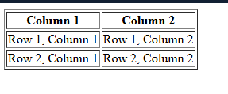

### 2.1.2. Form:
A form is used to collect user input, such as login information, registration details, or feedback.

Common Tags that are used to create a form:
- `<form>` → Creates the form.
- `<input>` → Input field.
- `<input type="radio">` → Radio button field.
- `<label>` → Label for the input field.
- `<textarea>` → Textarea field.
- `<select>` → Dropdown field.
- `<button>` → Button field.

```html
    <form>
        <label for="name">Name:</label>
        <input type="text" id="name" name="name">
        <br><br>

        <label for="email">Email:</label>
        <input type="email" id="email" name="email">
        <br><br>

        <label for="message">Message:</label>
        <textarea id="message" name="message"></textarea>
        <br><br>

        <label for="country">Country:</label>
        <select id="country" name="country">
            <option value="us">United States</option>
            <option value="ca">Canada</option>
            <option value="uk">United Kingdom</option>
        </select>
        <br><br>

        <input type="radio" id="male" name="gender" value="male">
        <label for="male">Male</label>
        <input type="radio" id="female" name="gender" value="female">
        <label for="female">Female</label>
        <br><br>

        <button type="submit">Submit</button>
    </form>
```

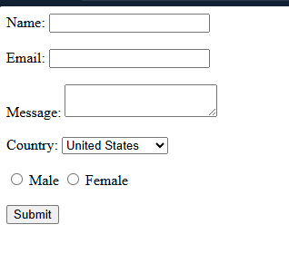

### 2.1.3. Hyperlink:
A hyperlink connects one web page or resource to another. It is created using the <a> (anchor) tag.

Common Attributes that are used to create a hyperlink:
- `href` → Specifies the URL of the page the link goes to.
- `target` → Specifies where to open the linked document (e.g., `_blank` for a new tab, `_self(default)` for the same tab).

```html
<a href="https://www.example.com" target="_blank">Visit Example</a>
```


### 2.1.4. Images:
An image is a visual representation that can be displayed on a web page. It is added using the  tag.

Common Attributes that are used to create an image:
- `src` → Specifies the path to the image file.
- `alt` → Specifies an alternative text for the image if the image cannot be displayed.

```html

```

Note: If we have nested folder then follow the folder order: 
```html

```

### 2.1.5. Lists:
A list is a collection of items that can be displayed in an ordered or unordered manner.    

Common Tags that are used to create a list:
- `<ul>` → Unordered list.
- `<ol>` → Ordered list.
- `<li>` → List item.

```html
<ul>
  <li>Item 1</li>
  <li>Item 2</li>
  <li>Item 3</li>
</ul>

<ol>
  <li>Item 1</li>
  <li>Item 2</li>
  <li>Item 3</li>
</ol>
```

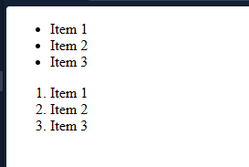


Note: Nested lists can be created by placing one list inside another list item.

```html
<ul>
  <li>Item 1</li>
  <li>Item 2
    <ul>
      <li>Subitem 2.1</li>
      <li>Subitem 2.2</li>
    </ul>
  </li>
  <li>Item 3</li>
</ul>
```

## 2.2. Difference Between Block and Inline Elements:
HTML elements are mainly divided into Block and Inline elements based on how they are displayed on a web page.

| Block Elements                             | Inline Elements                        |
| ------------------------------------------ | -------------------------------------- |
| Starts on a new line                       | Does not start on a new line           |
| Takes the full available width             | Does not take the full available width |
| Can contain both block and inline elements | Can only contain inline elements       |

### 2.2.1. Block Elements: 
A block element starts on a new line and takes up the full width available by default.

Characteristics:
- Starts on a new line.
- Takes the full available width.
- Can contain both block and inline elements.

Examples: 
```html
<div>
<p>
<h1> to <h6>
<section>
<article>
<ul>
<ol>
<table>
<form>
```

### 2.2.2. Inline Elements: 
An inline element does not start on a new line and takes up only the width necessary for its content.

Characteristics:
- Does not start on a new line.
- Does not take the full available width.
- Can only contain inline elements.

Examples: 
```html
<span>
<a>

<strong>
```

### 2.2.3. Block and Inline example: 

```html
<div>
  <p>This is a <strong>block</strong> element.</p>
  <span>This is an inline element.</span>
  <a href="#">This is another inline element.</a>
</div>
```

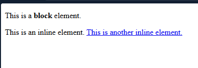

## 2.3. HTML Semantic Elements:  
https://github.com/muhammad-tamim/html-notes#html-semantic-elements

# 3. Chapter 3:
## 3.1. CSS Selectors (Element, Class, and ID):
A CSS selector is used to select HTML elements so that CSS styles can be applied to them.

The three most common selectors are:
- Element Selector
- Class Selector
- ID Selector

### 3.1.1. Element Selector:
An element selector selects all HTML elements of the same type.

- html
```html
<p>First paragraph</p> 
<p>Second paragraph</p>
```
- css
```css
p {
  color: red;
}
```

### 3.1.2. Class Selector:
A class selector selects one or more elements that have the same class name. It starts with a dot (.).

- html
```html
<p class="paragraph">First paragraph</p> 
<p class="paragraph">Second paragraph</p>
```
- css
```css
.paragraph {
  color: blue;
}
```

### 3.1.3. ID Selector:
An ID selector selects one unique element with a specific ID. It starts with a hash (#).

Note: An ID should be unique and used only once on a page.

- html

```html
<p id="paragraph">First paragraph</p>
```

- css

```css
#paragraph {
  color: green;
}
```

## 3.2. CSS Display Property:
The display property controls how an HTML element is displayed on a web page. It determines whether an element appears as a block, inline, inline-block, or none (hidden).

Common Values:
- block
- inline
- inline-block
- none

### 3.2.1. display: block:
Behaves like a block element. 

- html

```html
<span>This is an inline element.</span>
<span>This is an inline element.</span>
<span>This is an inline element.</span>
```

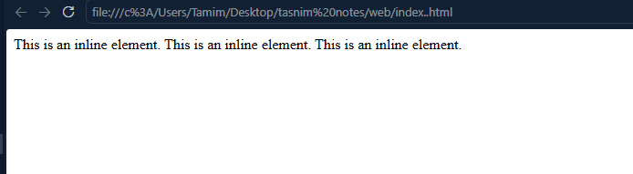

- css

```css
span {
  display: block;
}
```

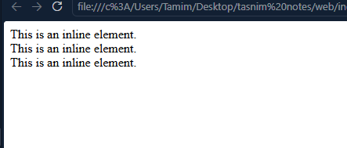

### 3.2.2. display: inline:
Behaves like an inline element.

- html

```html
<p>This is an block element.</p>
<p>This is an block element.</p>
<p>This is an block element.</p>
```
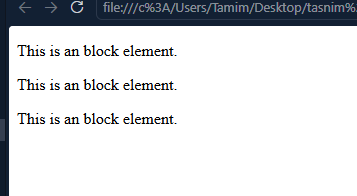

- css

```css
p {
  display: inline;
}
```
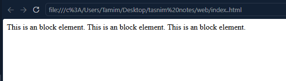   

### 3.2.3. display: inline-block:
An inline-block element:
  - Stays on the same line like an inline element.
  - Allows you to set width and height like a block element.

**Before Applying:**

- html

```html
<span>This is an inline element.</span>
<span>This is an inline element.</span>
<span>This is an inline element.</span>
```

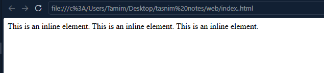

- css

```css
span {
  display: inline; /*Default for span element*/
  width: 150px;
  height: 50px;
}
```

**After Applying:**

- html

```html
<span>This is an inline element.</span>
<span>This is an inline element.</span>
<span>This is an inline element.</span>
```


- css

```css
span {
  display: inline-block;
  width: 150px;
  height: 50px;
}
```

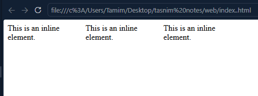


### 3.2.4. display: none: 
used to hide an element from the web page.

- html
  
```html
<p>This element will be hidden</p>
```  

- css

```css
p {
  display: none;
}
```

### 3.2.5. Summary: 

| Display Value | New Line? | Takes Full Width? | Width & Height Work? |
| ------------- | --------- | ----------------- | -------------------- |
| block         | ✅ Yes     | ✅ Yes             | ✅ Yes                |
| inline        | ❌ No      | ❌ No              | ❌ Usually No         |
| inline-block  | ❌ No      | ❌ No              | ✅ Yes                |
| none          | ❌ Hidden  | ❌ No              | ❌ Not displayed      |

## 3.3. CSS Position Property:
The position property determines how an HTML element is positioned on a web page. There are 5 values on the position property:
- Static → Default position.
- Relative → Move from its original position.
- Absolute → Position relative to the nearest positioned parent.
- Fixed → Fixed to the browser window.
- Sticky → Acts like relative, then sticks while scrolling.


### 3.3.1. position: static:
https://github.com/muhammad-tamim/css-notes#1401-staticdefault

### 3.3.2. position: relative:
https://github.com/muhammad-tamim/css-notes#1402-relative

### 3.3.3. position: absolute:
https://github.com/muhammad-tamim/css-notes#1403-absolute

### 3.3.4. position: sticky:
https://github.com/muhammad-tamim/css-notes#1404-sticky

### 3.3.5. position: fixed:
https://github.com/muhammad-tamim/css-notes#1405-fixed

### 3.3.6. CSS Grid: 
CSS Grid is a two-dimensional layout system used to arrange elements in rows and columns. It makes it easy to create complex and responsive web layouts.


common properties of CSS Grid:
- `display: grid;` → Defines a container as a grid.
- `grid-template-columns` → Defines the number and size of columns.
- `gap` → Defines the space between rows and columns.

#### 3.3.6.1. Simple Example:
- html

```html
<div class="container">
    <div class="item">1</div>
    <div class="item">2</div>
    <div class="item">3</div>
    <div class="item">4</div>
</div>
```
- css

```css
.container {
    display: grid;
    grid-template-columns: 1fr 1fr;
    gap: 10px;
}

.item {
    background-color: lightblue;
    padding: 20px;
    text-align: center;
}
```

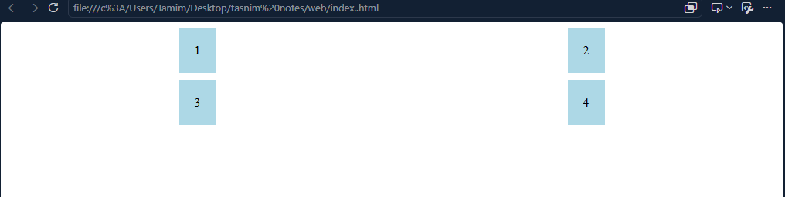

### 3.3.7. CSS Media Queries:
https://github.com/muhammad-tamim/css-notes#19-media-queries

## 3.4. CSS Viewport:  
The viewport is the visible area of a web page in the browser. The viewport size changes depending on the device: 
- Desktop → Large viewport
- Tablet → Medium viewport
- Mobile → Small viewport

Note: Responsive websites use the viewport to adjust their layout for different screen sizes.

### 3.4.1. Viewport Units: 

| Unit | Meaning                              |
| ---- | ------------------------------------ |
| vw   | 1% of the viewport width             |
| vh   | 1% of the viewport height            |
| vmin | 1% of the smaller viewport dimension |
| vmax | 1% of the larger viewport dimension  |

### 3.4.2. Examples:

1. Full Screen Height:

here, the The element takes 100% of the viewport height
```css
.hero { 
  height: 100vh; 
}
```

2. Half Screen Width: 

here, the The element takes 50% of the viewport width
```css
.box {
   width: 50vw; 
}  
```


## 3.5. How to add CSS: 
https://github.com/muhammad-tamim/css-notes#13-different-ways-to-add-css

## 3.6. Box Model: 
https://github.com/muhammad-tamim/css-notes#8-box-modal

## 3.7. Border: 
https://github.com/muhammad-tamim/css-notes#6-border
