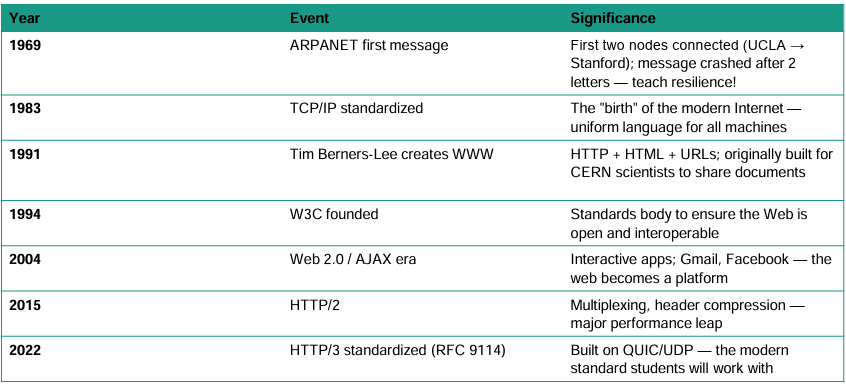

<h1 align="center">Web Programming</h1>

- [1. Introduction to the Internet and World Wide Web](#1-introduction-to-the-internet-and-world-wide-web)
  - [1.1. The Internet:](#11-the-internet)
  - [1.2. From fARPANET to Today:](#12-from-farpanet-to-today)
  - [1.3. Birth of The Web:](#13-birth-of-the-web)
  - [1.4. Who Runs The Internet:](#14-who-runs-the-internet)
  - [1.5. Intranets and Extranets:](#15-intranets-and-extranets)
  - [1.6. What is a Network:](#16-what-is-a-network)
  - [1.7. Components of a Network:](#17-components-of-a-network)
  - [1.8. Types of Networks:](#18-types-of-networks)
  - [1.9. TCP/IP (Transmission Control Protocol / Internet Protocol):](#19-tcpip-transmission-control-protocol--internet-protocol)
    - [1.9.1. TCP (Transmission Control Protocol):](#191-tcp-transmission-control-protocol)
    - [1.9.2. IP (Internet Protocol):](#192-ip-internet-protocol)
  - [URIs and URLs](#uris-and-urls)
    - [URI (Uniform Resource Identifier)](#uri-uniform-resource-identifier)
    - [URL (Uniform Resource Locator):](#url-uniform-resource-locator)

# 1. Introduction to the Internet and World Wide Web
## 1.1. The Internet: 
The Internet is a global network of interconnected computer networks that communicate using standard protocols (TCP/IP) to share information, resources, and services such as websites, email, file sharing, and online applications.

Note: The very first version of the internet began as a small network that connected computers at research institutions and universities. It was developed by the Advanced Research Projects Agency (ARPA) of the U.S. Department of Defense, and this early network was called ARPANET.

## 1.2. From fARPANET to Today:

## 1.3. Birth of The Web:
The World Wide Web (WWW) was invented by Tim Berners-Lee, a researcher at CERN. In 1991, he developed the World Wide Web and made it freely available to the public, making it easier for people to share and access information over the Internet.

The Web used Hypertext Transfer Protocol (HTTP) to communicate between web browsers (clients) and web servers, and Hypertext Markup Language (HTML) to create and format web pages.

In 1993, Marc Andreessen and graduate students at the National Center for Supercomputing Applications (NCSA), University of Illinois Urbana-Champaign, developed Mosaic, the first widely used graphical web browser. Unlike earlier text-based browsers, Mosaic allowed users to view text and images together, making the Web easier to use and helping it become popular worldwide.

## 1.4. Who Runs The Internet:
There is no single person, company, or government that owns or controls the Internet. Instead, it is managed through the:

1. **Internet Engineering Task Force (IETF):** The IETF develops and maintains Internet protocols and technical standards, such as TCP/IP and HTTP. It is an international community working to improve and ensure the smooth operation of the Internet.

2. **Internet Architecture Board (IAB):** The IAB is a committee of the IETF that provides technical guidance and oversees the publication of Request for Comments (RFC) documents.

3. **Request for Comments (RFC):** An RFC is an official document published by the IETF that defines Internet protocols, standards, and best practices.

4. **Internet Corporation for Assigned Names and Numbers (ICANN):** The ICANN coordinates the assignment of: Domain names,IP addresses, Protocol parameters, and Protocol port numbers.

## 1.5. Intranets and Extranets:
Organizations often need the communication benefits of the Internet without making their information public. In such cases, they use intranets and extranets.

- Intranet: An intranet is a private network that uses Internet technologies (such as TCP/IP, HTTP, and web browsers) to share information and resources within an organization. It is accessible only to authorized users, such as employees or members of the organization.

- Extranet: An extranet is a private network that allows controlled access to external users, such as business partners, suppliers, or customers. It extends the organization's intranet to authorized external parties, enabling secure communication and collaboration. 

## 1.6. What is a Network:
A network is a group of two or more computers or devices connected together to communicate and share resources such as files, printers, and the Internet.

## 1.7. Components of a Network:
1. Client: A client is a computer used by users to access files, websites, or other network resources.
   - Example: Your laptop or desktop computer.

2. Server: A server is a computer that stores data and provides services to clients.
   - Example: A file server or web server.

3. Networking Devices: Networking devices connect computers and help data travel across the network.
   - Common devices include: Hub, Switch, Router

4. Router: A router connects different networks and sends data to the correct destination.
- Example: Your home Wi-Fi router connects your home network to the Internet.

5. Network Media: Network media are the paths through which data travels.
   - They include: Copper cables, Fiber optic cables, Wireless (Wi-Fi)

## 1.8. Types of Networks: 
There are two types of networks based on their geographical coverage: 
1. Local Area Network (LAN): A LAN is a network that connects computers and devices within a limited area, such as a home, office, or school. It allows users to share resources like files, printers, and internet connections.
2. Wide Area Network (WAN): A WAN is a network that covers a large geographical area, such as a city, country, or even the entire world. The Internet is the largest example of a WAN, connecting millions of computers and devices globally.

## 1.9. TCP/IP (Transmission Control Protocol / Internet Protocol):
TCP/IP is the standard communication protocol used on the Internet. 

Note: 
- TCP = Breaks, checks, and rebuilds the data.
- IP = Finds where the data should go.

### 1.9.1. TCP (Transmission Control Protocol): 
TCP is responsible for:
- Breaking data into small pieces called packets
- Checking that packets arrive correctly
- Requesting missing or damaged packets again
- Reassembling the packets into the original data

### 1.9.2. IP (Internet Protocol):
IP is responsible for:

- Giving every device an IP address
- Sending packets to the correct destination

## URIs and URLs
When we access a website or resource on the Internet, we use a **URI** or a **URL**.

Note: 
- URI = Identity (Who or What is the resource?)
- URL = Location (Where is the resource and how can I access it?)

### URI (Uniform Resource Identifier)
A URI is a string of characters that identifies a resource on the Internet.
- It can identify a resource by name, location, or both.
- Every URL is a URI, but not every URI is a URL.

Examples:

- `https://www.google.com`
- `mailto:info@example.com`
- `urn:isbn:9780134685991`

### URL (Uniform Resource Locator):
A URL is a type of URI that identifies the location of a resource and tells the browser how to access it. A URL usually contains:
- Protocol (e.g., https)
- Domain name (e.g., www.google.com)
- Path (e.g., /images/logo.png)

Example: `https://www.example.com/about`

Where:
- `https` → Protocol
- `www.example.com` → Domain name
- `/about` → Path to the resource

